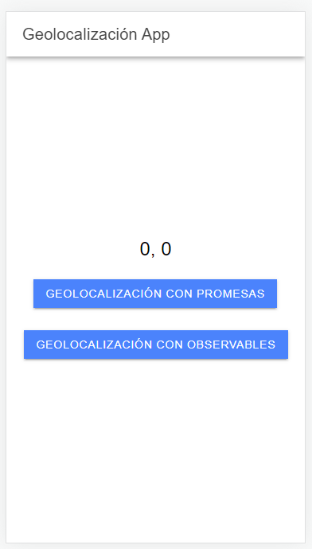
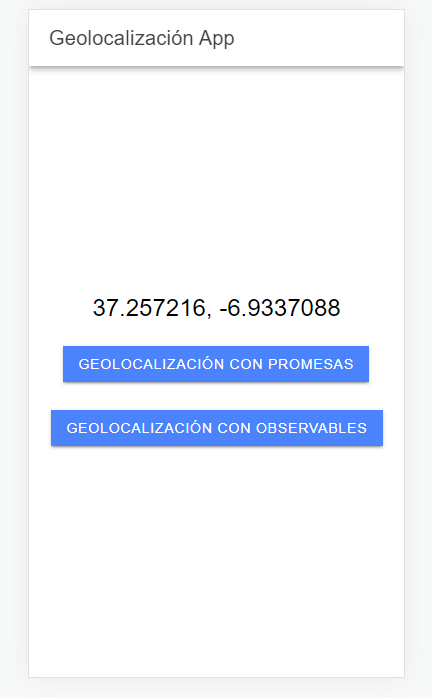

# test2-2

- [Ionic Geolocation](#ionic-geolocation)
  * [How to run](#how-to-run)
  * [Examples](#examples)

## Ionic Geolocation

  En este proyecto se pide lo siguiente:

  - Añadirle la librería de Geolocalización tanto para las promesas como para los observables.
  - Añadirle dos botones a la pagina home uno que muestre la geolocalización con promesas y otro que muestre la geolocalización con observables.

  ### How to run

  - cd geolocalizacionApp
  - npm i
  - ionic serve

  ### Examples
  - A continuación se muestra una imagen de la aplicación al arrancarla:

    

  - Aquí se muestra una imagen de la aplicación al haber pulsado uno de los dos botones:

    

